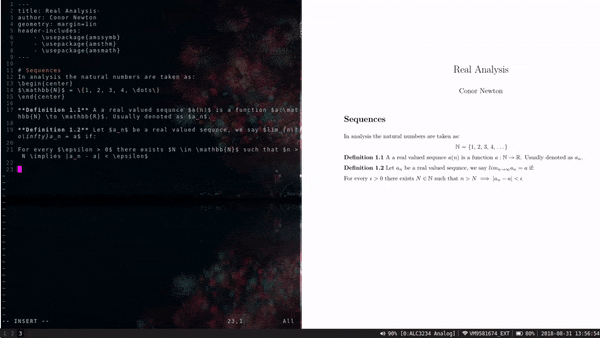

# Vim Pandoc Markdown Previewer



## Dependencies

* vim
* pandoc
* a pdf viewer:
    * Evince
    * Mupdf (My personal favourite)
    * Okular

## Installation

Just like any other vim plugin

## Usage

### Starting the preview

To start the preview mode:
```
:StartMdPreview
```
This will compile your markdown document and open it in one of the above pdf viewers.

After every save the previewer will be refreshed.

### Choosing a previewer

Stick the following in your vimrc, replacing <previewer> with the name of your preferred pdf viewer.

```
let g:md_pdf_viewer="<previewer>"
```
